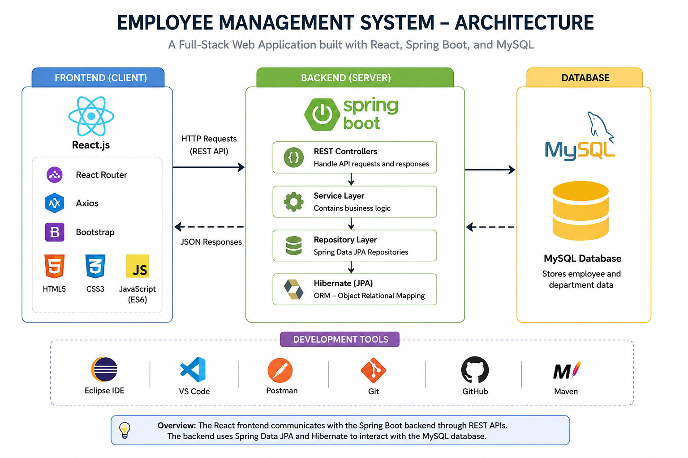
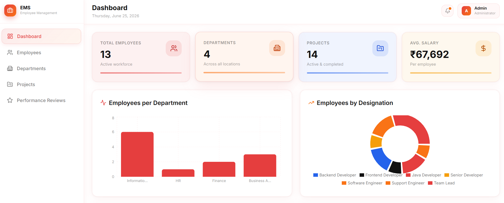
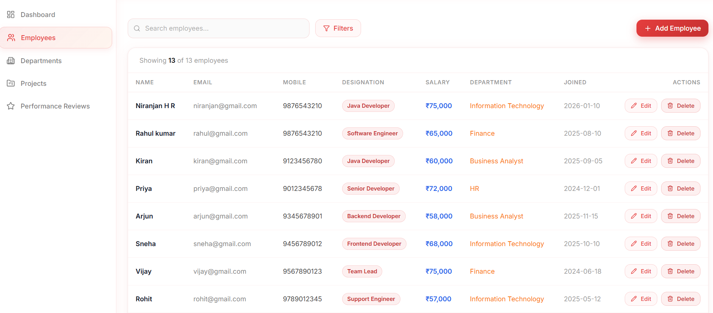
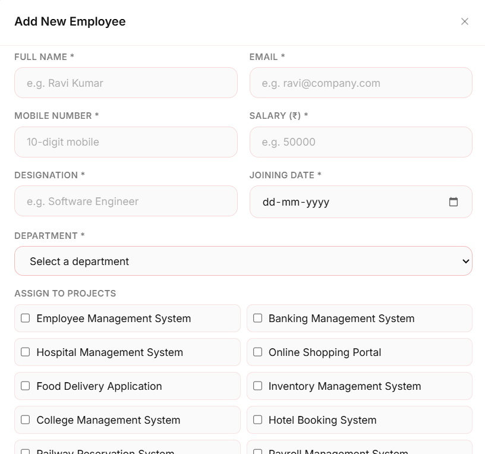
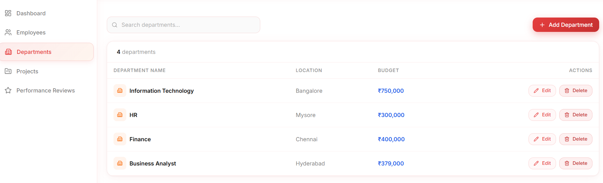
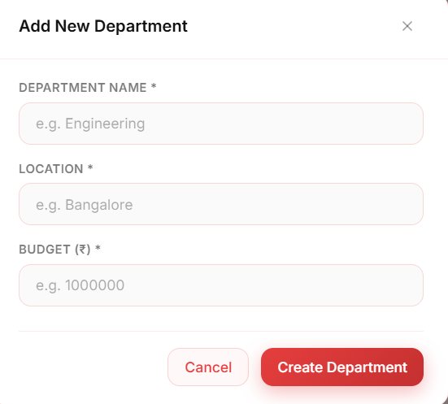

# Employee Management System

A full-stack Employee Management System developed using **Spring Boot**, **React**, and **MySQL**. The application enables efficient management of employees and departments through a responsive web interface and RESTful APIs.

## 📌 Overview

This project demonstrates the implementation of a modern full-stack web application following a layered architecture. It includes a React frontend, a Spring Boot backend, and a MySQL database, providing complete CRUD functionality for employee and department management.

## 🛠️ Tech Stack

### Frontend
- React.js
- Vite
- React Router
- Axios
- Bootstrap
- HTML5
- CSS3
- JavaScript (ES6)

### Backend
- Spring Boot
- Spring Data JPA
- Hibernate
- REST APIs
- Maven

### Database
- MySQL

### Development Tools
- Eclipse IDE
- Visual Studio Code
- Postman
- Git
- GitHub

## ✨ Features

### 👨‍💼 Employee Management
- Add new employees
- View employee details
- Update employee information
- Delete employee records

### 🏢 Department Management
- Add new departments
- View department details
- Update department information
- Delete department records

### 📊 Dashboard
- Displays employee and department information in a centralized dashboard.

### ✅ Form Validation
- Validates user input before submitting employee and department forms.

### 🔗 RESTful APIs
- Backend APIs developed using Spring Boot for seamless communication with the frontend.

### 🗄️ Database Integration
- Uses MySQL with Spring Data JPA and Hibernate for persistent data storage.

### 📱 Responsive User Interface
- Responsive and user-friendly interface developed using React and Bootstrap.

## 📂 Project Structure

Employee-Management-System/
│
├── README.md
│
├── employee-management-system-backend/
│   ├── src/
│   │   ├── main/
│   │   ├── test/
│   │   └── ...
│   ├── pom.xml
│   └── ...
│
├── employee-management-system-frontend/
│   ├── public/
│   ├── src/
│   ├── package.json
│   ├── vite.config.js
│   └── ...
│
└── .gitignore

React Frontend
        │
        ▼
REST APIs
        │
        ▼
Spring Boot
        │
        ▼
Spring Data JPA / Hibernate
        │
        ▼
MySQL Database

Employee-Management-System
│
├── docs
│   └── images
│
├── employee-management-system-backend
├── employee-management-system-frontend
└── README.md

## 🏗️ System Architecture

The Employee Management System follows a layered architecture where the React frontend communicates with the Spring Boot backend through REST APIs. The backend processes business logic, interacts with the MySQL database using Spring Data JPA and Hibernate, and returns JSON responses to the frontend.



## 📸 Application Screenshots

### 🏠 Dashboard



---

### 👨 Employee Management



---

### ➕ Add Employee



---

### 🏢 Department Management



---

### ➕ Add Department



## 🚀 Installation & Setup

### Clone the Repository

```bash
git clone <repository-url>
```

### Backend Setup

```bash
cd employee-management-system-backend
mvn spring-boot:run
```

### Frontend Setup

```bash
cd employee-management-system-frontend
npm install
npm run dev
```

### Database Configuration

Configure the following environment variables before running the backend:

| Variable | Description |
|----------|-------------|
| DB_URL | MySQL Database URL |
| DB_USERNAME | MySQL Username |
| DB_PASSWORD | MySQL Password |